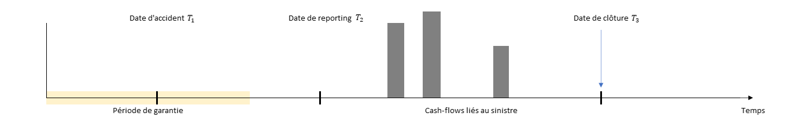

```{r, include=FALSE}
knitr::opts_chunk$set(echo = TRUE)
```


# Introduction

Un modèle de fréquence-sévérité classique, comme vu au chapitre 3 par deux types de sinistre.

On peut utiliser les arbes de régression. 

On rappelle le processus schématique de la vie d'un sinistre ci-dessous : 

```{r, echo=FALSE, fig.cap="From Jewell", out.width = '100%'}


```

# 
Les arbres de régression permettent de classifier les données en groupes homogènes. Cette classification permet d'associer la valeur la plus vraisemblable à ces groupes. Cette classification se fait via une suite de segmentations binaires. 

La segmentation est organisée de manière séquentielle, pour chaque scission d'arbre possible, on obtient une mesure d'erreur. Le point de départ est le modèle sans séparation. 

Pour une valeur de prédiction $\hat{y_i}$, on peut la comparer avec la valeur observée $y_i$. Lorsqu'on essaye de minimiser via les moindres carrés, l'objectif de minimisation est $\sum_i{(y_i - \hat{y_i})^2}$.

L'objectif de l'arbre tend à diminuer cette mesure de l'erreur en séparant les observations en deux régions, via une des caractéristiques de l'ensemble.  

La mesure d'erreur devient alors la somme des erreurs sur chacune des régions, la prédiction étant dépendante de la région d'observation:

$\sum_{j=1}^{J}\sum_{i \in R_j}{(y_i - \hat{y_i})^2}$.

La valeur frontière qui va déterminer à quel endroit la séparation a lieu est l'endroit qui minimise l'erreur de prédiction. 
t


# Application aux paiements.

On considère tout d'abord que le processus des paiements est modèle discret où les paiements sont observés annuellement.

Le nombre total de sinistres qui ont eu lieu pour une année de survenance $i$ et qui ont été reporté durant l'année de développement $j$ sont donnés par la sommme $M_{i,j} = \sum_{l=0}^{j} N_{i,l}$.


$p(x) = \sum_{j=1}^{2} \alpha_j p(x|j)$


Dans la modélisation sur les 


$p(x) = \sum_{j=1}^{2} \alpha_j p(x|j)$ 

On peut donc appliquer un algorithme de maximum de vraisemblance sur à la fois le paramètre $\alpha$ et sur les paramètres des distributions conditionnelles


$\ell(\theta) = \sum_{i=1}^n \log \left( \sum_{j=1}^2 \alpha_j p(x_i;\mu_j, \sigma_j^2) \right )$


```{r}

```


## Splitting the claims

p$Y_j = exp(\gamma_(i + j - 2)) $
 p
## 


